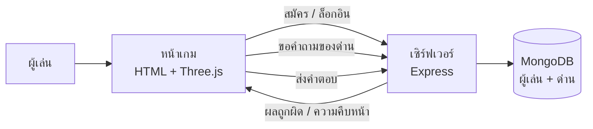

# K.O.QUIZZ

เกมตอบคำถามความรู้บนเว็บ ผู้เล่นตอบคำถามเพื่อต่อสู้กับบอสในสนามรบ 3 มิติ ตอบถูกตัวละครโจมตีบอส ตอบผิดถูกโจมตีกลับ

โปรเจกต์จบการศึกษา ปวช. วิทยาลัยเทคนิคสมุทรสงคราม ปีการศึกษา 2569

## ทำอะไรได้บ้าง

- คำถาม 13 หมวดวิชา หมวดละ 3 ระดับ เช่น เขียนโค้ด กฎหมายคอมพิวเตอร์ เทคโนโลยีและ AI
- ตัวละคร 3 ตัวและสนามรบ 3 แบบ แสดงผล 3 มิติ
- ระบบสมาชิก เก็บค่าประสบการณ์ เลเวล และด่านที่ผ่าน
- ตารางคะแนนผู้เล่น (Leaderboard)

## ขั้นตอนการทำงาน



1. **สมัครและล็อกอิน** — เซิร์ฟเวอร์เข้ารหัสรหัสผ่านด้วย bcrypt ก่อนบันทึก แล้วออก JWT ให้เกมใช้ยืนยันตัวตนในคำขอถัดไป
2. **เลือกตัวละครและหมวดวิชา** — เกมขอรายการด่านจากเซิร์ฟเวอร์ ด่านที่ผ่านแล้วจะปลดล็อกด่านถัดไป
3. **ต่อสู้** — เกมแสดงคำถามทีละข้อ ตอบถูกบอสเสียพลังชีวิต ตอบผิดผู้เล่นเสียพลังชีวิต
4. **ตรวจคำตอบที่เซิร์ฟเวอร์** — เกมส่งคำตอบไปให้เซิร์ฟเวอร์ตรวจ เฉลยจึงไม่ถูกส่งมาที่เบราว์เซอร์
5. **บันทึกความคืบหน้า** — ชนะแล้วเซิร์ฟเวอร์บันทึกค่าประสบการณ์ เลเวล และด่านที่ผ่านลงฐานข้อมูล

## เทคโนโลยีที่ใช้

| ส่วน | เทคโนโลยี |
| --- | --- |
| หน้าเกม | HTML, JavaScript, Three.js, Tailwind CSS |
| ระบบหลังบ้าน | Node.js, Express |
| ฐานข้อมูล | MongoDB (Mongoose) |
| ความปลอดภัย | JWT, bcrypt, Helmet, จำกัดจำนวนคำขอ, กรองข้อมูลก่อนเข้าฐานข้อมูล |

## โครงสร้างโค้ด

```
ส่วนเว็บ/            หน้าเกม
  index.html         หน้าหลักของเกม
  ระบบเกม/game.js    ตรรกะเกม การต่อสู้ และการเรียก API
  ตัวละคร/           โมเดลตัวละคร ท่าโจมตี และสนามรบ 3 มิติ
ส่วนdata/            ระบบหลังบ้าน
  server.js          จุดเริ่มต้นของเซิร์ฟเวอร์
  routes/            API: auth, users, stages, leaderboard
  models/            โครงสร้างข้อมูลผู้เล่นและด่าน
  middleware/auth.js ตรวจ JWT ก่อนเข้าถึงข้อมูลผู้เล่น
  data/stagesData.js คลังคำถามทั้งหมด
  scripts/seedStages.js  นำคำถามเข้าฐานข้อมูล
```

## API

| Endpoint | ทำอะไร |
| --- | --- |
| `POST /api/auth/register` | สมัครสมาชิก |
| `POST /api/auth/login` | เข้าสู่ระบบ |
| `GET /api/auth/me` | ข้อมูลผู้เล่นที่ล็อกอินอยู่ |
| `PATCH /api/users/me` | บันทึกความคืบหน้าของผู้เล่น |
| `GET /api/stages` | รายการหมวดวิชาและด่าน |
| `GET /api/stages/:stageId` | คำถามของด่าน |
| `POST /api/stages/:stageId/substages/:subStageId/verify` | ตรวจคำตอบ |
| `GET /api/leaderboard` | ตารางคะแนน |

## วิธีรันบนเครื่อง

ต้องมี Node.js 18 ขึ้นไป และฐานข้อมูล MongoDB (ใช้ MongoDB Atlas แบบฟรีได้)

**1. เซิร์ฟเวอร์**

```bash
cd ส่วนdata
npm install
cp .env.example .env        # แล้วเติมค่าของตัวเอง
node scripts/seedStages.js  # นำคำถามเข้าฐานข้อมูล ทำครั้งเดียว
npm start
```

เซิร์ฟเวอร์จะทำงานที่ http://localhost:4000

**2. หน้าเกม**

เปิดโฟลเดอร์ `ส่วนเว็บ` ด้วย Live Server ใน VS Code หรือเว็บเซิร์ฟเวอร์อื่น แล้วเปิด `index.html`
ที่อยู่ของหน้าเกมต้องตรงกับค่า `CORS_ORIGIN` ในไฟล์ `.env`

ห้าม commit ไฟล์ `.env` ขึ้น GitHub
